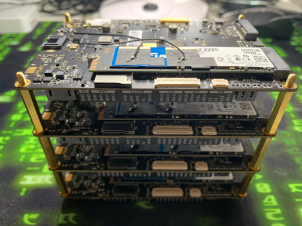
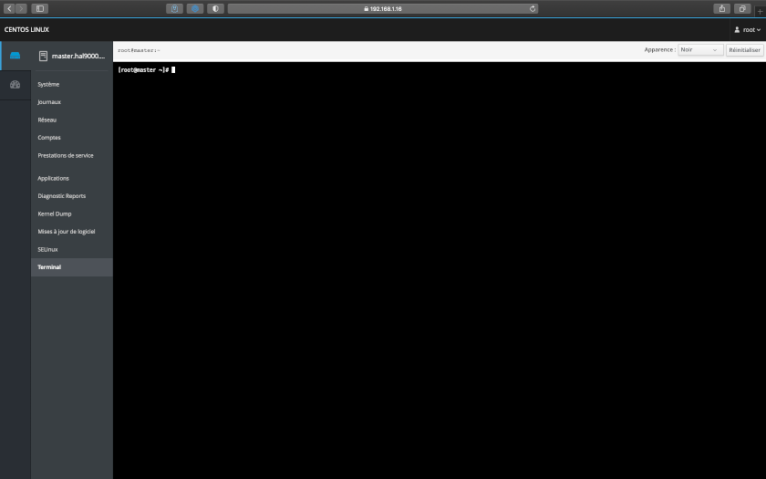

<!-- PROJECT SHIELDS -->
[![Contributors][contributors-shield]][contributors-url]
[![Forks][forks-shield]][forks-url]
[![Stargazers][stars-shield]][stars-url]
[![Issues][issues-shield]][issues-url]
[![GNU License][license-shield]][license-url]
[![LinkedIn][linkedin-shield]][linkedin-url]


<!-- PROJECT LOGO -->
<br />
<p align="center">
  <a href="https://github.com/AntoineMeheut/Rokc-Mk3">
    
    
    
  </a>

  <h3 align="center">Deploying OpenShift Origin 3.11 on bare metal cluster</h3>

  <p align="center">
    Rokc Mark 3 is the realization on a bar metal target of the Rokc-Mk2 project. The functional check on virtual machines of the OpenShift Origin installation allowed me to confirm the purchase of the target cards.
    <br />
    <br />
    <a href="https://github.com/AntoineMeheut/Rock-Mk3/issues">Report Bug</a>
    ·
    <a href="https://github.com/AntoineMeheut/Rock-Mk3/issues">Request Feature</a>
  </p>
</p>


<!-- TABLE OF CONTENTS -->
# Table of Contents

* [About the Project](#about-the-project)
	* [My goals](#my-goals)
	* [Features](#features)
	* [Feedback](#feedback)
	* [Experience sharing](#experience-sharing)
* [Create a private cloud](#create-a-private-cloud)
	* [Why create a private cloud](#why-create-a-private-cloud)
	* [Some information about data](#some-information-about-data)
	* [OpenShift presentation](#openShift-presentation)
	* [Why use Openshift](#why-use-Openshift)
	* [What can be done with Openshift](#what-can-be-done-with-Openshift)
	* [A bit of vocabulary](#a-bit-of-vocabulary)
	* [How Openshift works](#how-openshift-works)
* [Hardware](#hardware)
	* [Shopping list](#shopping-list)
	* [Cluster assembly](#cluster-assembly)
* [Software](#software)
	* [Lattepanda software installation](#lattepanda-software-installation)
	* [How to install the OS](#how-to-install-the-os)
	* [Router settings](#router-settings)
	* [Router operation](#router-operation)
	* [Installing the OS on the cards](#installing-the-os-on-the-cards)
		* [Install the OS on each card](#install-the-os-on-each-card)
	* [End of assembly and SSH access to servers](#end-of-assembly-and-ssh-access-to-servers)
* [Clone this repo](#clone-this-repo)
* [Install your personal PaaS](#install-your-personal-paas)
* [Deploying OpenShift Origin 3.11 on bare metal cluster](#deploying-openShift-origin-3.11-on-bare-metal-cluster)
	* [Inspiration](#inspiration)
	* [Diagram of infrastructure](#diagram-of-infrastructure)
	* [Infrastructure Setup](#infrastructure-Setup)
	* [Preparing all Nodes](#preparing-all-Nodes)
		* [Why a SD card?](#why-a-sd-card?)
		* [Installing Cockpit Admin Tool on CentOS 7](#installing-cockpit-admin-tool-on-centOS-7)
			* [Install Cockpit](#install-cockpit)
			* [Install additional Cockpit packages](#install-additional-cockpit-packages)
			* [Enable Cockpit](#enable-cockpit)
			* [Add cockpit to firewall](#add-cockpit-to-firewall)
			* [Network setup](#network-setup)
				* [Set the hostname for each corresponding node](#set-the-hostname-for-each-corresponding-node)
				* [Configure static ip](#configure-static-ip)
				* [Configure names resolution](#configure-names-resolution)
			* [Openshift Origin 3.11 installation](#openshift-origin-3.11-installation)
				* [Installation of OKD 3.11 and Ansible](#installation-of-okd-3.11-and-Ansible)
				* [Add docker to firewall](#add-docker-to-firewall)
				* [Now you can reboot your node](#now-you-can-reboot-your-node)
				* [If you want to stop a node](#if-you-want-to-stop-a-node)
	* [Connect to your nodes cockpit interfaces](#connect-to-your-nodes-cockpit-interfaces)
	* [Deploying and starting Openshift Origin 3.11 from master node](#deploying-and-starting-openshift-origin-3.11-from-master-node)
		* [Preparation on master only](#preparation-on-master-only)
			* [Creating an RSA key](#creating-an-RSA-key)
			* [Declare the target nodes for the key](#declare-the-target-nodes-for-the-key)
			* [Send the public-key to all the nodes](#send-the-public-key-to-all-the-nodes)
		* [Preparing the hosts file for Ansible](#preparing-the-hosts-file-for-Ansible)
		* [Run prerequisites playbook](#run-prerequisites-playbook)
		* [Run deploy cluster playbook](#run-deploy-cluster-playbook)
	* [Useful commands to verify that it works](#useful-commands-to-verify-that-it-works)
		* [See the state of your nodes](#see-the-state-of-your-nodes)
		* [View status with labels](#view-status-with-labels)
		* [See the state of your pods](#see-the-state-of-your-pods)
		* [Create User Accounts for OKD console](#create-user-accounts-for-okd-console)
			* [Create a user account](#create-a-user-account)
			* [Restart OpenShift before going forward](#restart-openShift-before-going-forward)
	* [Access the OKD console](#access-the-okd-console)
* [Application deployment](#application-deployment)
 	* [Deploy a test application with openshift CLI](#deploy-a-test-application-with-openshift-CLI)
 		* [Create a new project](#create-a-new-project)
 		* [Load an application on your project](#load-an-application-on-your-project)
 		* [Check your application status](#check-your-application-status)
 		* [Check your application pod](#check-your-application-pod)
 		* [Check you application service](#check-you-application-service)
 		* [Try localy your application](#try-localy-your-application)
* [Roadmap](#roadmap)
* [Contributing](#contributing)
* [License](#license)
* [Contact](#contact)
* [Acknowledgements](#acknowledgements)

<!-- ABOUT THE PROJECT -->
## About The Project
The previous versions of Rokc allowed me to create a Kubernetes Cloud on Raspberry Pi, an Openshift Origin on VMs and to share the knowledge acquired
for the hardware, the various installations, the ssh, the network and Ansible. I hit a wall, when I tried to compile
openshift origin for ARM, I unfortunately did not manage to get an installable image on recent versions of openshift.
It does not matter, after some research I decided to use Lattepanda machines, because I always want to be able to carry
my Cloud with me, to show it to all the people who are wondering what a Cloud really is. .

I hope that this sharing will be useful to you and will allow you to embark in your turn in the understanding
and the manufacture of a Cloud. You will see it's not that complex.

So let's go ...

### My goals

* Create a private cloud cluster from 4 [Lattepanda](https://www.lattepanda.com)
* Connect my MacBook to this cluster to use, manage and monitor it
* Install Openshift Origin with [Ansible](https://www.ansible.com/)
* Deploy applications on this cluster
* Being able to move this cluster, use it for demos and therefore : all works in environments where WiFi and network
are not accessible to the cluster
* Share my knowledge and recipes acquired

### Features

* Create a private cloud
* Hardware architecture
* Installation of a personal cloud
* Deploying OpenShift Origin 3.11 on bare metal cluster
* Openshift monitoring
* Application deployment
* Application monitoring

### Feedback

* The existing documentation for the installation of OKD is very precise and experimentation shows that it is really necessary to share the precise actions carried out on the servers, to prepare them for the correct execution of the ansible scripts for the OKD installation, it is the objective of this sharing
* To get to the target quickly and because I did not plan to open internet access to this Cloud, I voluntarily reduced the operations for securing this Cloud to a minimum. If you reproduce this sharing, therefore be careful about the use you will make of this Cloud

### Experience sharing
* You may need to adapt the scripts from this project to create your own cloud
* The way I do it's simple, I open a terminal to run scripts and playbooks, at the same time I open the project
in an IDE and adapt the code of the project when necessary
* To save time in problem analysis, you can add to each ansible command the --vvv option, which allows you to have
verbose mode

## Create a private cloud
### Why create a private cloud
The first question we could ask ourselves is: "Why have a private cloud in my information system".

Well the answer is quite simple: "I do not wish to entrust my data and my applications to third parties". Indeed,
before enjoying the advantages of a Cloud, you must think about the value and the confidentiality of the data
and computer processing that you are going to deploy on this Cloud. I remain personally convinced that what has
the most values is and will always restore the customers. And it is true that more and more companies are concerned
about the value of the data that its customers entrust to it and also of the algorithms that process those data.

It then becomes obvious that you cannot entrust just anything to just anyone and that reading the GCU of the different
Cloud providers is very important.

To convince you, I have placed in the next section some links to very current topics about data and
what can be done with it.

### Some information about data
Many governments, companies and individuals are aware today and take action to know and regulate the use
of the data they entrust. To convince you, I can quote:

* The Cloud Act which in 2018 raised awareness, because this law notably allows American courts to solicit
from operators the personal communications of an individual without the latter being informed, nor his country
of residence, nor that the country where those data are stored.
[CLOUD Act] (https://www.congress.gov/bill/115th-congress/senate-bill/2383/text)
* The GDPR (General Data Protection Regulation) is a regulation of the European Union which strengthens
and unifies data protection for individuals within the European Union.
[GDPR] (https://afcdp.net/reglement-europeen-rgpd-indexe-commente/)
* An example of the Google Drive GCU, which explains very clearly that Google can use your data to improve
its services. [Google Drive GCU] (https://support.google.com/drive/answer/2450387?hl=en)

### OpenShift presentation
OpenShift is a PaaS (Platform-as-a-Service) solution. In general, companies use it to build,
deploy and run applications in containers. It is available in open source under the Apache 2.0 license,
it is available in two products: Origin (community) or Enterprise.

Openshift is clearly carried by Red Hat and the main contributors to this project mostly work at Red Hat.

Since version 3 and the big redesign, Openshift relies completely on Docker and Kubernetes from Google. The life of this
product will therefore depend on these two backbones.

### Why use Openshift
If I had to retain a main reason for using Openshift, well I would say that it's much easier for a Cloud team
to benefit from the Docker encapsulation work and especially Kubernetes which is carried out by the Red Hat teams.
This makes it possible to concentrate on the services to be provided to end customers in companies such as trades
and projects.

Creating and running a private cloud in production requires a lot of technical skills and time, using Openshift
has a cost, of course, and this allows you to have support and a stabilized base by the Red Hat teams.

### What can be done with Openshift
Typically, build and deploy applications automatically. There are several ways to do this, the main ones
are :

* Docker File mode, which allows you to automatically build a Docker container by providing OpenShift the address
of a source code manager pointing to a Docker File and its dependencies. We use it a lot to migrate projects from
old virtual environments to our Cloud.
* Source To Image mode which allows you to automatically build an application by pushing the source code application
in OpenShift. I use it to make starter-kits for trades, it indicates a Git repository where is the code that a startup
has built with them, their credentials and presto the application starts.
* Custom Build mode which allows you to provide your own logic for building an application by providing OpenShift
a Docker image designed for this purpose. It can be used for applications which have an original stack compared
to most of the usual applications deployed on a Cloud. This allows for tailor-made.
 
One of the very interesting advantages of OpenShift is that it allows you to define an automated deployment strategy
of an application when a new image version is published in the registry or when the configuration
of the application is updated. Typically it is taking advantage of the best advantages of DevSecOps for projects
or trades.

In addition to these build and deployment modes, OpenShift offers the possibility of defining its own application
“blue prints” in the form of “template” files in Json or Yaml format. These "blue prints" describe both the topology
of the application architecture and the container deployment policy. This makes it possible to industrialize application
 deployments for a company that has already worked on the standardization of its development stacks.

### A bit of vocabulary
Some concepts that are important to understand before starting:

* POD: it is a Docker container execution environment local to a server,
* Service: it is an entry point (VIP) making abstract "load-balanced" access to a group of identical containers.
In principle, we deploy a Service by third of the architecture,
* Deployment Config: this is an object that describes a deployment policy for a container based on triggers
(for example: redeploy when a new version of an image is available in the Docker registry),
* Replication Controller: it is a technical component in charge of POD resilience,
* Route: A route exposes an entry point (DNS hostname or VIP) outside of an application.

### How Openshift works
Quickly, the node or nodes which control the others serve:

* process requests to the administration API,
* carry out image build operations and container deployment,
* ensure the resilience (replication) of the PODs where your applications operate,
* he or they use a distributed etcd directory for configuration sharing and service discovery.

The managed nodes host the PODs and run containers (application and / or Registry).

It is possible to interact with the platform through its REST API, CLI or via its Web portal.

## Hardware
### Shopping list
Here is the shopping list, with links (not affiliated) to references that I have used.
I let you search for other equipment and especially how to buy this equipment according to your favorite stores.

This cluster must be able to operate without a network other than the local loop constituted by the cluster itself
and the macbook which is connected to it, this allows the cluster to be taken for demonstrations in environments
where the network is closed for reasons of security.

This list of components also allows you to understand and share what the simplest representation of a Cloud is.
All the clouds in the world, from the simplest to the most complex, are composed of: servers, linked together by network switches,
connected to disks to store information. And yes a Cloud is just that.


| Number | Parts |
| ------ | ---- |
| 4 | [LattePanda Alpha 864](https://www.lattepanda.com/products/lattepanda-alpha-864s.html) |
| 4 | [Crucial P1 500Go](https://www.crucial.fr/ssd/p1/ct500p1ssd8) |
| 1 | [Network switch](https://www.tp-link.com/fr/home-networking/soho-switch/ls108g/) |
| 5 | [Cat 6 Cables](https://www.startech.com/Cables/Network/Cat-6/#N6PATCH1BL) |
| 1 | [Router (for demo)](https://eu.dlink.com/fr/fr/for-home/routers-and-modems) |

### Cluster assembly
You will have to mount the SSD disks in their location on the back of the Lattepanda Alpha, it's not very complicated.

The WiFi antennas are not mounted and available separately in the box, it's not mandatory to mount them, because
they are intended to be glued on a box for the Lattepanda and for this project we will use
the RJ45 connection.

In the end, I still mounted the WiFi antennas, in case I need this type of connection. As I chose
to mount the 4 Lattepanda with the support screws of the Rapsberry cluster from the previous project, so I glued
Wifi antennas on SSDs, it's not very clean as an installation, but it does the trick.



## Software
### Lattepanda software installation
The first thing to do is to install an OS on the cards, I chose to use Centos, because it is
an open source distribution that is closest to RHEL and that I find very well designed and practical to use
when you start on the creation of a Cloud.

[CentOS-7-x86_64-Minimal-2003.iso](http://isoredirect.centos.org/centos/7/isos/x86_64/)

The version I used is a server ISO: CentOS-7-x86_64-Minimal-2003.iso

Centos OS is less well known than Ubuntu for example and the commands are often a little different between these two OS.
It is for this reason that I placed in this tutorial, all the commands that I used to prepare the OS.

With this version you will therefore not have a desktop on your OS, but do not panic, we will see below, how
use the web cockpit of each server, to avoid a lot of command line typing. You will just have to open this README file on a computer,
connect to the nodes cockpit and copy / paste the commands.

### How to install the OS
The first thing to do is download the iso and burn it on a usb key. For that I use a standard 16 Gb usb key
and this software [etcher](https://www.balena.io/etcher/)

Then it's very important to proceed in this way, I carry out the assembly part of the cards in cluster and
their connection to the network before installing the OS. Apart from the fact that this is always how I do it
usually, this allows the OS installer software to detect the network and activate the software layer
network at the time of installation. If you installed a Centos server on a card without it being connected to the
network, when you start it, the network software layer will not be active and you will not be able to connect
in ssh to the node.

After mounting the cluster, connecting them to the network switch and to the portable router, we get that.


### Router settings
So that the OS installation software can access the internet and also you can access your
SSH nodes from your computer, whether at home or on the go, you need to install a mini local network.

For this we will use the dlink Router and configure it to have the operating mode in Range Extender.
The documentation of these small pieces of equipment is well done, you shouldn't have too many problems. And like
everything related to networks can sometimes seem confusing, I will try to show you what to do.


### Router operation
The mode of action of the router that we are going to choose is Range Extender. This allows you to connect your computer by RJ45
to the network loop in which your cluster is located and this allows you to access the internet through your
home wifi network. This allows you to make the necessary updates to your Cloud and it allows you to take
your Cloud with you for demonstrations.


For obvious security reasons, when you have finished updating and installing Openshift Origin,
I advise you to change the operating mode of your router. To do this, you just need to use the operating
mode where the bridge to your wifi is cut.

### Installing the OS on the cards
You must then connect a screen, a keyboard, a mouse and the installation usb key to the first card.

#### Install the OS on each card
Turn on the card and press F7 to get the boot media choice menu.


I do the US installation by default, because I use a querty keyboard and once the Centos cockpit is installed, it manages for me the azerty keyboard of my macbook.


Choose the installation target, the little orange triangle in the photo.


The installation is done on the onboard memory of the card.


If you had an OS already installed on the card, consider freeing up this space.


Above all, remember to activate the network on the RJ45 when installing the OS, because doing these operations after installation is much longer, the installer handling all this very well for you.


During the installation, you must choose a password for the admin account and create an origin user account. Remember to indicate that this user account has administrator rights, this is not what is done in a secure installation, but for our OpenShift Origin test environment this will be sufficient. Be careful if you then want to host applications accessible from the internet on your PaaS, you should not proceed in this way and add security to all the steps of this tutorial. I do not have this objective of applications and therefore to save time and simplify this tutorial, I will not do all the steps of securing the platform.


You can move on to the next card, while the installer completes that card.
![Cockpit(images/Centos-8.jpeg)

### End of assembly and SSH access to servers
Once the 4 cards with their OS installed, you can then connect your computer to the local network of your cluster
and access the cockpit web interface that will allow you to update your OS and perform all the operations you
will need and this even with the command line. You can therefore access your 4 cards from the same computer
and therefore: we put the screen away, the calvier and the mouse!

You must then locate the IP address of each of your cards and connect to the Centos server interface of
each card.
```
ip addr
```

The address is like this: https://XXX.XXX.X.XX:9090



## Clone this repo
If you haven't already done so, you can clone this repository to copy / paste the command lines.

	git clone https://github.com/AntoineMeheut/Rokc-Mk3.git Rokc-Mk3
	cd Rokc-Mk3

## Install your personal PaaS
This tutorial is designed to share with you my experience of installing PaaS on equipment that you can have at home, without transforming your living room into a server room.

This tutorial is independent and is part of a project that will assemble several of the tutorials that you will find on my GitHub, to create a portable PaaS Cloud, which allows me to do demonstrations and thus try to demistify what the Cloud is.

## Deploying OpenShift Origin 3.11 on bare metal cluster
### Inspiration
* [Installing OKD documentation](https://docs.okd.io/3.11/install/running_install.html)

### Diagram of infrastructure
```
--+------------------+------------------+------------------+-------------
  |192.168.1.16      |192.168.1.17      |192.168.1.18      |192.168.1.19
+-+------------+   +-+------------+   +-+------------+   +-+------------+
|[ master ]    |   |[ node1 ]     |   |[ node2 ]     |   |[ node3 ]     |
|(Master Node) |   |(Compute Node)|   |(Compute Node)|   |(Compute Node)|
|(Infra Node)  |   |              |   |              |   |              |
|(Compute Node)|   |              |   |              |   |              |
+--------------+   +--------------+   +--------------+   +--------------+
```

### Infrastructure Setup
| Hostname | IP Address | CPU | Thread | RAM HDD | eMMC | NVMe SSD | OS | Role |
| ---- | ---- | ---- | ---- | ---- | ---- | ---- | ---- | ---- |
| master.openshift.hal9000.com | 192.168.1.16 | Intel m3 | 4 | 8Gb | 64Gb | 500Gb | Centos-7 | Master |
| node1.openshift.hal9000.com | 192.168.1.17 | Intel m3 | 4 | 8Gb | 64Gb | 500Gb | Centos-7 | Node 1 |
| node2.openshift.hal9000.com | 192.168.1.18 | Intel m3 | 4 | 8Gb | 64Gb | 500Gb | Centos-7 | Node 2 |
| node3.openshift.hal9000.com | 192.168.1.19 | Intel m3 | 4 | 8Gb | 64Gb | 500Gb | Centos-7 | Node 3 |

### Preparing all Nodes
#### Why a SD card?
There is a small bug in the LattePanda bios which for the moment and to my knowledge has not yet been fixed. Once you have installed Centos on the card, it will permanently display a message indicating that Centos cannot restart the hardware slot of the SD card. The way to get rid of this message is to insert an SD card into the slot.

#### Installing cockpit admin tool on CentOS 7
Cockpit is very practical when you have to access a lot of servers and especially not to rack your brains to operate a Mackbook keyboard on a Centos server. Cockpit handles this for you and allows you to copy / paste your orders.

Of course you have to think about deactivating it, for security, once you have finished, but here we are doing a test and there are no plans to open this PaaS to the outside. It would then be necessary to address all the notions of security on the servers and the PaaS itself.

So this experiment is planned to make demonstrations on a network not connected to the Internet, which in fact secures the installation and avoids carrying out all the security part of the installation.

##### Install Cockpit
```
yum install -y cockpit
```
##### Install additional Cockpit packages
```
yum install -y cockpit-networkmanager cockpit-dashboard cockpit-storaged cockpit-packagekit
```
##### Enable Cockpit
```
systemctl enable --now cockpit.socket
```
##### Add cockpit to firewall
```
firewall-cmd --permanent --add-service=cockpit
firewall-cmd --reload
```

Before connecting with the cockpit to the node, you must locate the IP address which has been assigned to it with its current configuration in DHCP. We will use this IP to connect, modify the IP configuration file to have a static one, which will facilitate access to each node.

```
ip addr
```

From now on you can use this IP address to connect with the cockpit or continue with your current installation in terminal mode directly on the map.

#### Network setup
##### Set the hostname for each corresponding node
Master

```
hostnamectl set-hostname master.hal9000.com
```
Node1

```
hostnamectl set-hostname node1.hal9000.com
```
Node2

```
hostnamectl set-hostname node2.hal9000.com
```
Node3

```
hostnamectl set-hostname node3.hal9000.com
```
##### Configure static ip
```
vi /etc/sysconfig/network-scripts/ifcfg-enp2s0
```

Change BOOTPROTO from dhcp to static and add the following lignes to the file. Do that for each nodes with IPADDR 16 for master, 17 for infra, 18, for node1 and 19 for node2.

Realy take care of the GATEWAY cause it allow you to access to internet on my network configuration it's 192.168.1.254

Take care to keep the UUID of the file you are modifying, you can delete all lines except this one.

```
TYPE=Ethernet
PROXY_METHODE="none"
BROWSER_ONLY=no
BOOTPROTO=static
DEFROUTE=yes
IPV4_FAILURE_FATAL=no
IPV6INIT=no
IPV6_AUTOCONF="yes"
IPV6_DEFROUTE="yes"
IPV6_FAILURE_FATAL="no"
IPV6_ADDR_GEN_MODE="stable-privacy"
NAME=enp2s0
DEVICE=enp2s0
ONBOOT=yes
PROXY_METHOD=none
IPADDR=192.168.1.16
PREFIX=24
NETMASK=255.255.255.0
GATEWAY=192.168.1.254
DNS1=8.8.8.8
UUID=<quit the line in your file>
```

##### Configure names resolution
Configure /etc/hosts file for name resolution as following.

```
vi /etc/hosts
```

```
127.0.0.1   localhost localhost.localdomain localhost4 localhost4.localdomain4
192.168.1.16   master.hal9000.com  master
192.168.1.17   node1.hal9000.com  node1
192.168.1.18   node2.hal9000.com  node2
192.168.1.19   node3.hal9000.com  node3
::1         localhost localhost.localdomain localhost6 localhost6.localdomain6
```

#### Openshift Origin 3.11 installation
##### Installation of OKD 3.11 and Ansible
On all Nodes, install OpenShift Origin 3.11 repository, Ansible and Docker.

For Ansible, version 2.6, 2.7, 2.8, 2.9 are provided from CentOS Repository, but Openshift-Ansible is not supported on 2.8 or later, so install Ansible 2.7

```
yum -y install centos-release-openshift-origin311 centos-release-ansible-27
yum -y install ansible openshift-ansible docker git pyOpenSSL
systemctl enable --now docker
```

##### Add docker to firewall
```
firewall-cmd --permanent --zone=trusted --change-interface=docker0
firewall-cmd --permanent --zone=trusted --add-port=4243/tcp
firewall-cmd --reload
```

##### Now you can reboot your node
```
reboot
```

##### If you want to stop a node
LattePanda cards are powerful and heat up, no more than normal, but being able to press the tiny switch that will send the stop signal to the card, without feeling the heat of the card on your fingers is not easy.

Just use this command and it will be easier.

```
poweroff
```

**Once here, repeat the section preparing all nodes for node1, node2 and node3.**

### Connect to your nodes cockpit interfaces
You should connect on root on all ur nodes.

* master [https://192.168.1.16:9090](https://192.168.1.16:9090)
* node1 [https://192.168.1.17:9090](https://192.168.1.17:9090)
* node2 [https://192.168.1.18:9090](https://192.168.1.18:9090)
* node3 [https://192.168.1.19:9090](https://192.168.1.19:9090)

### Deploying and starting Openshift Origin 3.11 from master node
#### Preparation on master only
This declaration of targets for the sharing of the RSA key and the sending of keys which follow, simply avoids having to enter the login and password of each node when Ansible executes the installation scripts of Openshift Origin.

##### Creating an RSA key
```
ssh-keygen -q -N ""
```

##### Declare the target nodes for the key

```
vi ~/.ssh/config
```

```
Host master
    Hostname master.hal9000.com
    User root
Host node1
    Hostname node1.hal9000.com
    User root
Host node2
    Hostname node2.hal9000.com
    User root
Host node3
    Hostname node3.hal9000.com
    User root
```

##### Send the public-key to all the nodes
```
chmod 600 ~/.ssh/config
```

```
ssh-copy-id master
ssh-copy-id node1
ssh-copy-id node2
ssh-copy-id node3
```

#### Preparing the hosts file for Ansible
```
vi /etc/ansible/hosts
```

```
#
# Ansible inventory for OpenShift Origin Platform  3.11
#

###########################################################################
#
# Ansible script that will be used to identify the targets of the deployment
# and use the variables for Openshift Origin
#
###########################################################################

###########################################################################
# Configuring your inventory file
# https://docs.openshift.com/container-platform/3.11/install/configuring_inventory_file.html
# add follows to the end
###########################################################################

###########################################################################
### OpenShift Hosts
###########################################################################
[OSEv3:children]
masters
nodes
etcd

[masters]
master.hal9000.com openshift_schedulable=true containerized=false

[etcd]
master.hal9000.com

[nodes]
# Defined values for [openshift_node_group_name] in the file below
# [/usr/share/ansible/openshift-ansible/roles/openshift_facts/defaults/main.yml]
master.hal9000.com openshift_node_group_name='node-config-master-infra'
node1.hal9000.com openshift_node_group_name='node-config-compute'
node2.hal9000.com openshift_node_group_name='node-config-compute'
node3.hal9000.com openshift_node_group_name='node-config-compute'

###########################################################################
### Ansible Vars
###########################################################################
[OSEv3:vars]
# Admin user created in previous section
ansible_ssh_user=root

# Use it if the installation user is not root
# ansible_become=true

# Deployment type
openshift_deployment_type=origin
# openshift_deployment_type=openshift-enterprise

# WARNING: only disable these checks in LAB/TEST environments(Do not use in production)
# The master node must have 16 Gb of memory and it works fine with 8 Gb
openshift_disable_check="disk_availability,memory_availability"

###########################################################################
### OpenShift Registries Locations
###########################################################################
# Use HTPasswd for authentication
openshift_master_identity_providers=[{'name': 'htpasswd_auth', 'login': 'true', 'challenge': 'true', 'kind': 'HTPasswdPasswordIdentityProvider'}]

###########################################################################
### OpenShift Master Vars
###########################################################################
# Define default sub-domain for Master node
openshift_master_default_subdomain=apps.hal9000.com

###########################################################################
# Image for a cluster with a working registry-console in 3.11
# Because the console which is installed by default has a bug that prevents it from starting
###########################################################################
openshift_cockpit_deployer_image='docker.io/timbordemann/cockpit-kubernetes:latest'

# Allow unencrypted connection within cluster
# Be careful, it's just to use a Cloud not connected to the internet, for a production target, you have to do it differently
openshift_docker_insecure_registries=192.168.1.16/16
```

#### Run prerequisites playbook
```
ansible-playbook /usr/share/ansible/openshift-ansible/playbooks/prerequisites.yml
```

#### Run deploy cluster playbook
```
ansible-playbook /usr/share/ansible/openshift-ansible/playbooks/deploy_cluster.yml
```

You have to get something like this.

```
INSTALLER STATUS ****************************************************************************************************************************************************************************************
Initialization               : Complete (0:00:33)
Health Check                 : Complete (0:02:18)
Node Bootstrap Preparation   : Complete (0:11:42)
etcd Install                 : Complete (0:00:55)
Master Install               : Complete (0:05:17)
Master Additional Install    : Complete (0:00:34)
Node Join                    : Complete (0:00:27)
Hosted Install               : Complete (0:00:53)
Cluster Monitoring Operator  : Complete (0:02:49)
Web Console Install          : Complete (0:01:35)
Console Install              : Complete (0:00:28)
metrics-server Install       : Complete (0:00:01)
Service Catalog Install      : Complete (0:04:50)
```

If after the execution you do not have an error message and you get a complete on all the steps, bravo! Openshift Origin is installed.

### Useful commands to verify that it works
#### See the state of your nodes
```
oc get nodes
```
You have to get something like this.

```
NAME                 STATUS    ROLES          AGE       VERSION
master.hal9000.com   Ready     infra,master   20m       v1.11.0+d4cacc0
node1.hal9000.com    Ready     compute        16m       v1.11.0+d4cacc0
node2.hal9000.com    Ready     compute        16m       v1.11.0+d4cacc0
node3.hal9000.com    Ready     compute        16m       v1.11.0+d4cacc0
```

#### View status with labels
```
oc get nodes --show-labels=true
```
You have to get something like this.

```
NAME                 STATUS    ROLES          AGE       VERSION           LABELS
master.hal9000.com   Ready     infra,master   20m       v1.11.0+d4cacc0   beta.kubernetes.io/arch=amd64,beta.kubernetes.io/os=linux,kubernetes.io/hostname=master.hal9000.com,node-role.kubernetes.io/infra=true,node-role.kubernetes.io/master=true
node1.hal9000.com    Ready     compute        17m       v1.11.0+d4cacc0   beta.kubernetes.io/arch=amd64,beta.kubernetes.io/os=linux,kubernetes.io/hostname=node1.hal9000.com,node-role.kubernetes.io/compute=true
node2.hal9000.com    Ready     compute        17m       v1.11.0+d4cacc0   beta.kubernetes.io/arch=amd64,beta.kubernetes.io/os=linux,kubernetes.io/hostname=node2.hal9000.com,node-role.kubernetes.io/compute=true
node3.hal9000.com    Ready     compute        17m       v1.11.0+d4cacc0   beta.kubernetes.io/arch=amd64,beta.kubernetes.io/os=linux,kubernetes.io/hostname=node3.hal9000.com,node-role.kubernetes.io/compute=true
```

#### See the state of your pods
```
oc get pods
```
You have to get something like this.

```
NAME                       READY     STATUS    RESTARTS   AGE
docker-registry-1-b528c    1/1       Running   0          43m
registry-console-1-frrb9   1/1       Running   0          43m
router-1-wz4bg             1/1       Running   0          43m
```

```
oc describe pod registry-console-1-frrb9
```
You have to get something like this.

```
Name:               registry-console-1-frrb9
Namespace:          default
Priority:           0
PriorityClassName:  <none>
Node:               master.hal9000.com/192.168.1.16
Start Time:         Thu, 01 Oct 2020 16:42:36 -0400
Labels:             deployment=registry-console-1
                    deploymentconfig=registry-console
                    name=registry-console
Annotations:        openshift.io/deployment-config.latest-version=1
                    openshift.io/deployment-config.name=registry-console
                    openshift.io/deployment.name=registry-console-1
                    openshift.io/scc=restricted
Status:             Running
IP:                 10.128.0.6
Controlled By:      ReplicationController/registry-console-1
Containers:
  registry-console:
    Container ID:   docker://5e6ff90a80d38a3a36981631e1e86025e329f9b7145c4c4ec469afbc05736a6f
    Image:          docker.io/timbordemann/cockpit-kubernetes:latest
    Image ID:       docker-pullable://docker.io/timbordemann/cockpit-kubernetes@sha256:f38c7b0d2b85989f058bf78c1759bec5b5d633f26651ea74753eac98f9e70c9b
    Port:           9090/TCP
    Host Port:      0/TCP
    State:          Running
      Started:      Thu, 01 Oct 2020 16:43:56 -0400
    Ready:          True
    Restart Count:  0
    Liveness:       http-get http://:9090/ping delay=10s timeout=5s period=10s #success=1 #failure=3
    Readiness:      http-get http://:9090/ping delay=0s timeout=5s period=10s #success=1 #failure=3
    Environment:
      OPENSHIFT_OAUTH_PROVIDER_URL:  https://master.hal9000.com:8443
      OPENSHIFT_OAUTH_CLIENT_ID:     cockpit-oauth-client
      KUBERNETES_INSECURE:           false
      COCKPIT_KUBE_INSECURE:         false
      REGISTRY_ONLY:                 true
      REGISTRY_HOST:                 docker-registry-default.apps.hal9000.com
    Mounts:
      /var/run/secrets/kubernetes.io/serviceaccount from default-token-mcsbs (ro)
Conditions:
  Type              Status
  Initialized       True 
  Ready             True 
  ContainersReady   True 
  PodScheduled      True 
Volumes:
  default-token-mcsbs:
    Type:        Secret (a volume populated by a Secret)
    SecretName:  default-token-mcsbs
    Optional:    false
QoS Class:       BestEffort
Node-Selectors:  node-role.kubernetes.io/master=true
Tolerations:     <none>
Events:
  Type    Reason     Age   From                         Message
  ----    ------     ----  ----                         -------
  Normal  Scheduled  44m   default-scheduler            Successfully assigned default/registry-console-1-frrb9 to master.hal9000.com
  Normal  Pulling    44m   kubelet, master.hal9000.com  pulling image "docker.io/timbordemann/cockpit-kubernetes:latest"
  Normal  Pulled     42m   kubelet, master.hal9000.com  Successfully pulled image "docker.io/timbordemann/cockpit-kubernetes:latest"
  Normal  Created    42m   kubelet, master.hal9000.com  Created container
  Normal  Started    42m   kubelet, master.hal9000.com  Started container
```

The adresse of your OKD console is here : OPENSHIFT_OAUTH_PROVIDER_URL:  https://master.hal9000.com:8443

Because it's not possible to access to this address with the IP, you should open the hosts file of the computer you want to use to access to the OKD console and add the master DNS ident to the file.
```
192.168.1.16   master.hal9000.com  master
```

#### Create User Accounts for OKD console
You can use the httpd-tools package to obtain the htpasswd binary that can generate these accounts.

```
yum -y install httpd-tools
```

##### Create a user account

```
touch /etc/origin/master/htpasswd
htpasswd -b /etc/origin/master/htpasswd admin redhat
```

You can create, for example, a user like this one, admin, with the password, redhat.

##### Restart OpenShift before going forward
```
master-restart api
master-restart controllers
```

Give this user account cluster-admin privileges, which allows it to do everything.

```
oc adm policy add-cluster-role-to-user cluster-admin admin
```

### Access the OKD console

[https://master.hal9000.com:8443](https://master.hal9000.com:8443)


## Application deployment
### Deploy a test application with openshift CLI
#### Create a new project
```
oc login -u admin
oc new-project test-project
```

#### Load an application on your project
```
oc new-app centos/ruby-25-centos7~https://github.com/sclorg/ruby-ex.git
oc expose svc/ruby-ex
```

#### Check your application status
```
oc status
```
You have to get something like this.

```
In project test-project on server https://master.hal9000.com:8443

svc/ruby-ex - 172.30.6.251:8080
  dc/ruby-ex deploys istag/ruby-ex:latest <-
    bc/ruby-ex source builds https://github.com/sclorg/ruby-ex.git on istag/ruby-25-centos7:latest 
      build #1 pending for 2 seconds
    deployment #1 waiting on image or update


2 infos identified, use 'oc status --suggest' to see details.
```

#### Check your application pod
```
oc get pods
```
You have to get something like this.

```
NAME              READY     STATUS    RESTARTS   AGE
ruby-ex-1-build   1/1       Running   0          1m
```

#### Check you application service
```
oc describe service ruby-ex
```
You have to get something like this.

```
In project test-project on server https://master.hal9000.com:8443

svc/ruby-ex - 172.30.6.251:8080
  dc/ruby-ex deploys istag/ruby-ex:latest <-
    bc/ruby-ex source builds https://github.com/sclorg/ruby-ex.git on istag/ruby-25-centos7:latest 
      build #1 pending for 2 seconds
    deployment #1 waiting on image or update


2 infos identified, use 'oc status --suggest' to see details.
[root@master ~]# oc get pods
NAME              READY     STATUS    RESTARTS   AGE
ruby-ex-1-build   1/1       Running   0          1m
[root@master ~]# oc describe service ruby-ex
Name:              ruby-ex
Namespace:         test-project
Labels:            app=ruby-ex
Annotations:       openshift.io/generated-by=OpenShiftNewApp
Selector:          app=ruby-ex,deploymentconfig=ruby-ex
Type:              ClusterIP
IP:                172.30.6.251
Port:              8080-tcp  8080/TCP
TargetPort:        8080/TCP
Endpoints:         <none>
Session Affinity:  None
Events:            <none>
```

#### Try localy your application
```
curl 172.30.6.251:8080
```

<!-- ROADMAP -->
## Roadmap

See the [Project](https://github.com/AntoineMeheut/Rokc-Mk3/projects) for a list of proposed features (and known issues).

<!-- CONTRIBUTING -->
## Contributing

Contributions are what make the open source community such an amazing place to be learn, inspire, and create.
Any contributions you make are **greatly appreciated**.

1. Fork the Project
2. Create your Feature Branch (`git checkout -b feature/AmazingFeature`)
3. Commit your Changes (`git commit -m 'Add some AmazingFeature'`)
4. Push to the Branch (`git push origin feature/AmazingFeature`)
5. Open a Pull Request

<!-- LICENSE -->
## License

Distributed under the MIT License. See `LICENSE` for more information.

<!-- CONTACT -->
## Contact

Antoine Méheut - [@Linkedin_antoine-meheut](https://www.linkedin.com/in/antoine-meheut)

Project Link: [https://github.com/AntoineMeheut/Rokc-Mk3](https://github.com/AntoineMeheut/Rokc-Mk3)

<!-- ACKNOWLEDGEMENTS -->
## Acknowledgements
* [Installing OKD documentation](https://docs.okd.io/3.11/install/running_install.html)


<!-- MARKDOWN LINKS & IMAGES -->
<!-- https://www.markdownguide.org/basic-syntax/#reference-style-links -->
[contributors-shield]: https://img.shields.io/github/contributors/AntoineMeheut/Rokc-Mk3?color=green
[contributors-url]: https://github.com/AntoineMeheut/Rokc-Mk3/graphs/contributors
[forks-shield]: https://img.shields.io/github/forks/AntoineMeheut/Rokc-Mk3
[forks-url]: https://github.com/AntoineMeheut/Rokc-Mk3/network/members
[stars-shield]: https://img.shields.io/github/stars/AntoineMeheut/Rokc-Mk3
[stars-url]: https://github.com/AntoineMeheut/Rokc-Mk3/stargazers
[issues-shield]: https://img.shields.io/github/issues/AntoineMeheut/Rokc-Mk3
[issues-url]: https://github.com/AntoineMeheut/Rokc-Mk3/issues
[license-shield]: https://img.shields.io/github/license/AntoineMeheut/kafka_producer
[license-url]: https://github.com/AntoineMeheut/kafka_producer/blob/master/LICENSE
[linkedin-shield]: https://img.shields.io/badge/-LinkedIn-black.svg?style=flat-square&logo=linkedin&colorB=555
[linkedin-url]: https://www.linkedin.com/in/antoine-meheut
